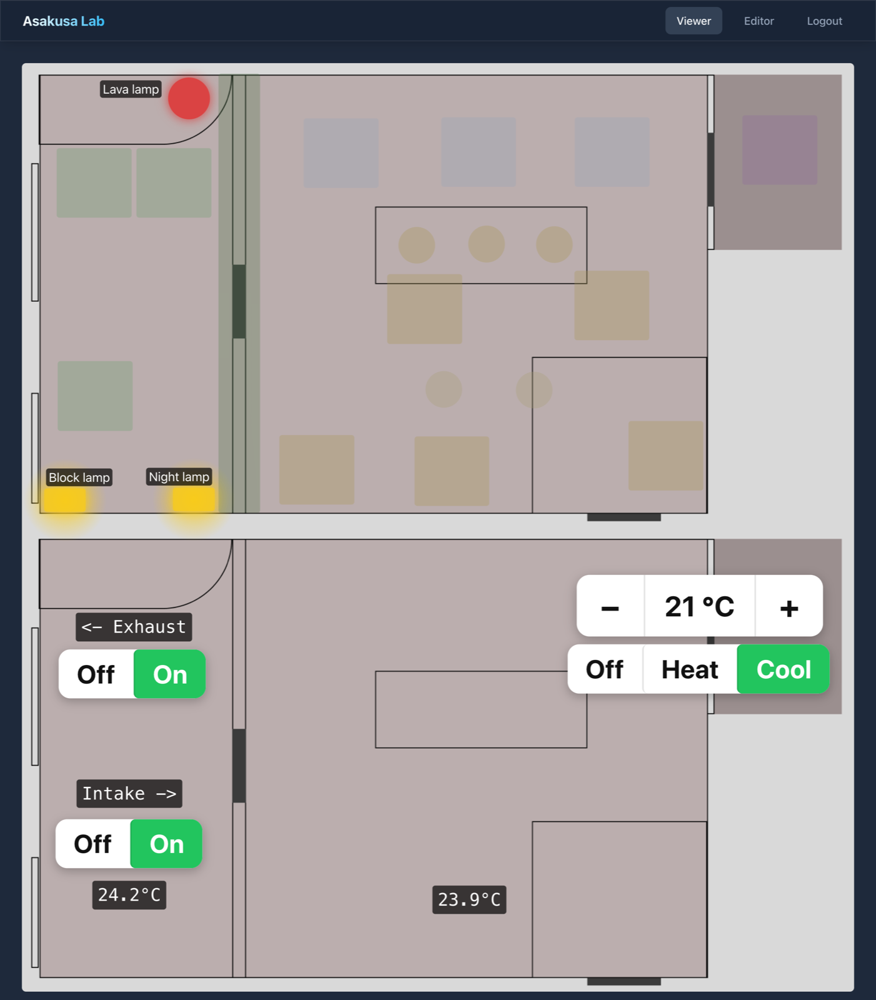
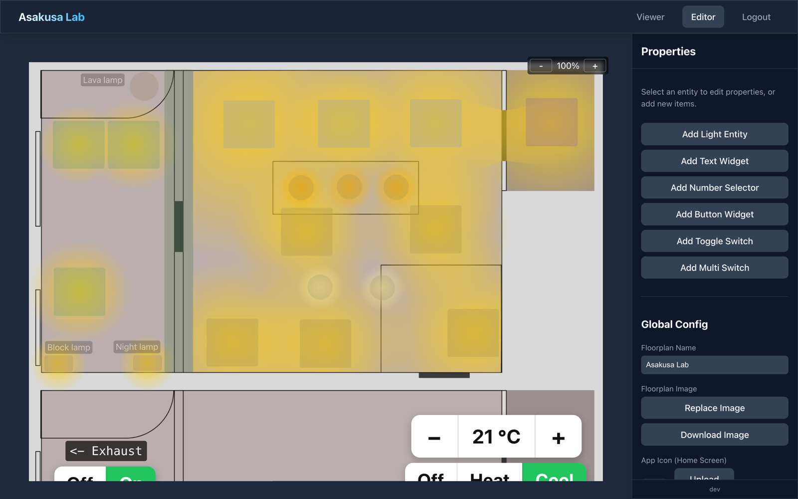

# Smarthome Floorplan

Self-hosted interactive floorplan for zigbee2mqtt devices. A Vue 3 + Vite PWA
frontend with a visual editor, served by a Python FastAPI backend that bridges
MQTT (zigbee2mqtt device state plus raw read/write topics), persists the floorplan
config, and protects everything behind a password-based HttpOnly session cookie.

## Screenshots

**Viewer** — live floorplan: lights, text read-outs, a number stepper, toggles and a
multi-state (select) switch, all reacting to MQTT.



**Editor** — place and style entities, switch widget types, manage the background
image and home-screen icon, and import/export the whole config.



## Features
- Visual editor: place entities on an uploaded floorplan image; set their position,
  size, rotation, and shape (circle / square / rect / custom polygon for light spread).
- Widget types, each bound to MQTT:
  - **Light** — live zigbee2mqtt state; click to toggle or set brightness.
  - **Text** — show a value pulled from a JSON payload via a path + format string.
  - **Number** — stepper that reads/writes a raw value over two topics (min/max/step/unit).
  - **Button** — publish a fixed raw value to a topic on click.
  - **Toggle** — two-state switch over raw on/off values.
  - **Select** — multi-state switch (e.g. AC heat / cool / off) over preset options.
- Import/export: download or upload the whole floorplan config as JSON, and download
  the current background image.
- Custom home-screen icon (uploadable PNG, with a bundled default).
- Installable, offline-capable PWA: the app shell and floorplan config are
  service-worker cached (stale-while-revalidate) for instant repeat loads.
- Single password login (HttpOnly session cookie, survives PWA relaunches).

## Architecture
- **Frontend** (`src/`): Vue 3 + Vite + TypeScript, built to static assets.
- **Backend** (`server/`): FastAPI; serves the built frontend, exposes `/api/*`,
  subscribes to `zigbee2mqtt/#`, and stores state under `data/`.
- Packaged as a single Docker image (multi-stage: build frontend → run backend).

## Configuration (ENV)
All config comes from the environment (see `.env.example`). Copy and fill it:
```bash
cp .env.example .env
```

| Variable         | Required | Default          | Description                                    |
| ---------------- | -------- | ---------------- | ---------------------------------------------- |
| `AUTH_PASSWORD`  | yes      | —                | Login password (also default session secret).  |
| `MQTT_HOST`      | yes      | —                | MQTT broker host (your own service).           |
| `MQTT_PORT`      | no       | `1883`           | MQTT broker port.                              |
| `MQTT_USERNAME`  | no       | —                | MQTT username (if the broker requires auth).   |
| `MQTT_PASSWORD`  | no       | —                | MQTT password.                                 |
| `Z2M_BASE`       | no       | `zigbee2mqtt`    | zigbee2mqtt base MQTT topic.                   |
| `SECRET_KEY`     | no       | `AUTH_PASSWORD`  | Session signing key.                           |
| `SESSION_MAX_AGE`| no       | `31536000`       | Session lifetime (seconds).                    |
| `COOKIE_SECURE`  | no       | `true`           | Set `false` for local HTTP dev.                |
| `APP_TITLE`      | no       | `Z2M Floorplan`  | App title shown in the UI.                     |
| `PORT`           | no       | `8000`           | Backend listen port.                           |
| `LOG_LEVEL`      | no       | `INFO`           | Logging level.                                 |
| `CONFIG_PATH`    | no       | `data/config.json` | Floorplan config path (under `data/`).       |
| `ICON_PATH`      | no       | `data/icon.png`  | Custom icon path (under `data/`).              |

## Local development
```bash
make install            # create .venv, install backend dev/test deps
cp .env.example .env    # set AUTH_PASSWORD, MQTT_HOST, COOKIE_SECURE=false
make run                # backend API on :8000
make dev                # Vite dev server (proxies /api to :8000)
make test               # run backend tests (pytest)
npm run test            # run frontend unit tests (Vitest); npm run test:e2e for Playwright
```

## Deployment
Built and published to `ghcr.io` by GitHub Actions (`test` → `build`/push). On the
host, pull the image via docker-compose; `watchtower` auto-updates it. See
`docker-compose.yml` for a sample (Traefik labels, `/app/data` volume, healthcheck).
